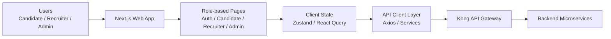
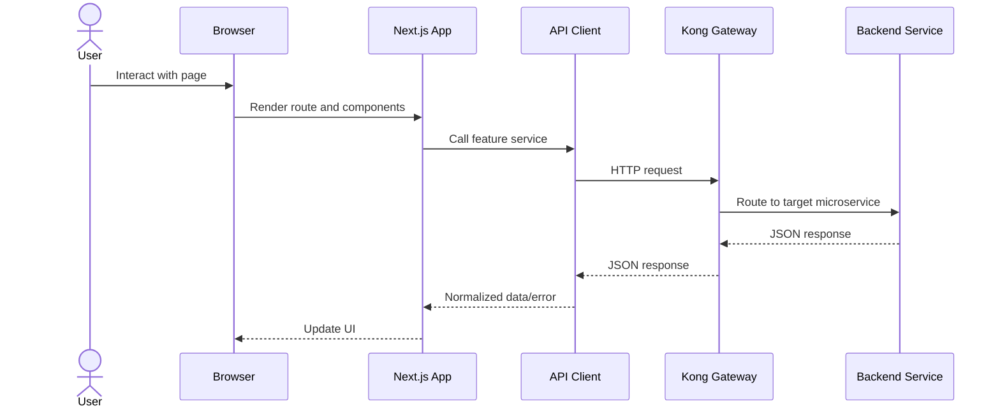
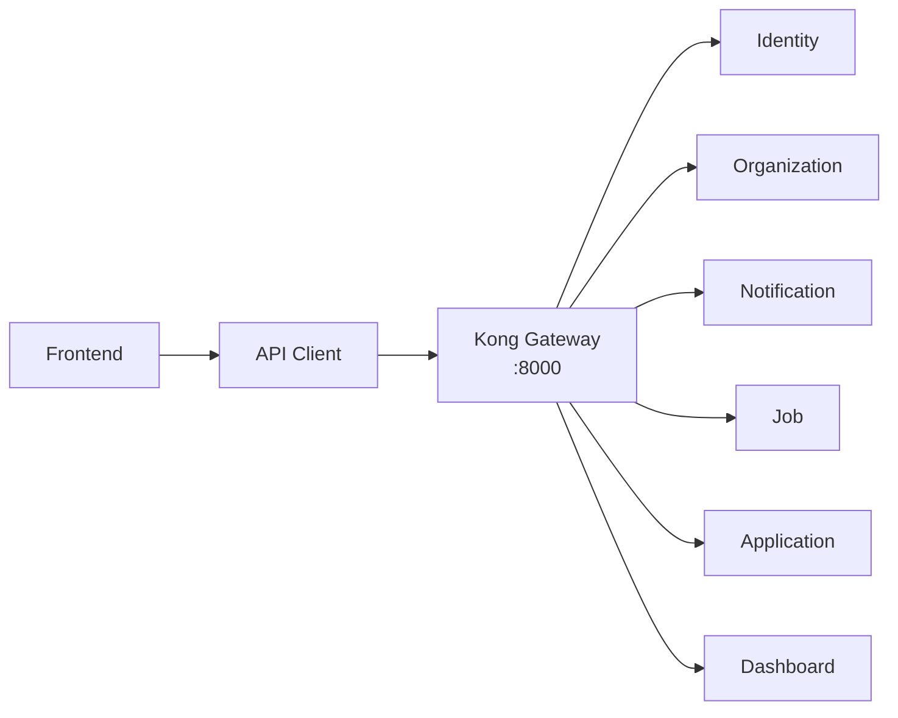

# IT Job Platform Frontend

Frontend application for **IT Job Platform**, a role-based IT recruitment platform for candidates, recruiters and administrators. The application is built with Next.js and integrates with the backend through Kong API Gateway.

The backend repository lives at `../it-job-platform`.

## Table of Contents

- [Overview](#overview)
- [Features](#features)
- [Frontend Architecture](#frontend-architecture)
- [Technology Stack](#technology-stack)
- [Repository Structure](#repository-structure)
- [Routes and User Roles](#routes-and-user-roles)
- [Environment Variables](#environment-variables)
- [Local Development](#local-development)
- [API Integration](#api-integration)
- [Demo Accounts](#demo-accounts)
- [Testing](#testing)
- [Docker](#docker)
- [CI/CD Deployment](#cicd-deployment)
- [Troubleshooting](#troubleshooting)

## Overview

This repository contains the web UI for IT Job Platform. It provides the complete user-facing experience for:

- Candidate job discovery and applications.
- Recruiter job and candidate management.
- Administrator dashboard and platform management.
- Authentication, registration, email verification, password reset and profile management.

The frontend does not call backend services directly. Browser requests are sent to Kong Gateway, which routes them to the appropriate backend service.

## Features

### Candidate

- Register and verify account.
- Sign in and manage profile.
- Search and filter IT jobs.
- View job detail.
- Save favorite jobs.
- Apply to jobs and track applied jobs.
- View notifications.

### Recruiter

- Register recruiter account.
- Manage recruiter profile.
- Manage branches.
- Create and update job postings.
- Review candidates and applications.
- View recruiter notifications.

### Administrator

- View admin dashboard.
- Manage categories.
- Manage companies.
- Manage users.
- Review pending jobs.
- View notifications.

## Frontend Architecture



### Request Flow



## Technology Stack

- **Next.js 16** with App Router.
- **React 19**.
- **TypeScript**.
- **Tailwind CSS 4**.
- **Radix UI** and custom UI components.
- **Lucide React** for icons.
- **Axios** for API requests.
- **TanStack React Query** for server state.
- **Zustand** for client state.
- **Recharts** for dashboard charts.
- **Swiper** for carousel/slider UI.
- **Playwright** for UI E2E tests.
- **Docker** for production packaging.
- **GitHub Actions** and **GHCR** for deployment.

## Repository Structure

```text
it-job-platform-fe/
├── .github/workflows/
│   ├── deploy-frontend.yml        # Build/push frontend image and deploy to VPS
│   └── ui-e2e.yml                 # Playwright E2E workflow
├── app/
│   ├── (auth)/                    # Login, register, verify, reset password
│   ├── (main)/                    # Authenticated role-based pages
│   ├── layout.tsx
│   └── page.tsx
├── components/                    # Shared and feature UI components
├── hooks/                         # Shared React hooks
├── lib/                           # Utilities, API helpers, config
├── providers/                     # App-level providers
├── public/                        # Static assets
├── services/                      # Feature API clients
├── store/                         # Zustand stores
├── tests/e2e/                     # Playwright E2E tests
├── types/                         # Shared TypeScript types
├── Dockerfile
├── playwright.config.ts
└── package.json
```

## Routes and User Roles

### Public and Auth Routes

| Route | Purpose |
| --- | --- |
| `/` | Landing or redirect entry |
| `/login` | Sign in |
| `/register` | Choose registration type |
| `/register/candidate` | Candidate registration |
| `/register/recruiter` | Recruiter registration |
| `/verify-email` | Email verification |
| `/verify-otp` | OTP verification |
| `/forgot-password` | Request password reset |
| `/reset-password` | Reset password |

### Candidate Routes

| Route | Purpose |
| --- | --- |
| `/candidate/find-jobs` | Search and filter jobs |
| `/candidate/favorite-jobs` | Saved jobs |
| `/candidate/applied-jobs` | Applications |
| `/candidate/profile` | Candidate profile |
| `/candidate/notifications` | Candidate notifications |

### Recruiter Routes

| Route | Purpose |
| --- | --- |
| `/recruiter/manage-jobs` | Manage job postings |
| `/recruiter/post-job` | Create job posting |
| `/recruiter/candidates` | View candidates/applications |
| `/recruiter/branches` | Manage branches |
| `/recruiter/profile` | Recruiter profile |
| `/recruiter/notifications` | Recruiter notifications |

### Admin Routes

| Route | Purpose |
| --- | --- |
| `/admin/dashboard` | Admin dashboard |
| `/admin/categories` | Category management |
| `/admin/companies` | Company management |
| `/admin/users` | User management |
| `/admin/jobs-review` | Job review |
| `/admin/notifications` | Admin notifications |

## Environment Variables

Create local env:

```bash
cp .env.example .env.local
```

PowerShell:

```powershell
Copy-Item .env.example .env.local
```

`.env.example`:

```env
NEXT_PUBLIC_API_URL=
INTERNAL_API_URL=
```

| Variable | Used by | Description |
| --- | --- | --- |
| `NEXT_PUBLIC_API_URL` | Browser/client bundle | Public API gateway base URL. If empty, the app infers `http://<current-host>:8000`. |
| `INTERNAL_API_URL` | Server/container runtime | Internal API gateway URL for SSR/server-side requests, for example `http://kong:8000` in Docker. |

### API URL Behavior

If `NEXT_PUBLIC_API_URL` is empty:

- Opening `http://localhost:3000` makes the browser call `http://localhost:8000`.
- Opening `http://103.153.74.191:3000` makes the browser call `http://103.153.74.191:8000`.

This keeps the frontend usable on both local development and VPS without hardcoding `localhost` into production builds.

## Local Development

### Prerequisites

- Node.js 20+.
- npm 10+.
- Backend stack running through the backend repository.

### Install dependencies

```bash
npm install
```

### Start dev server

```bash
npm run dev
```

Open:

```text
http://localhost:3000
```

### Build

```bash
npm run build
```

### Start production build

```bash
npm run start
```

### Lint

```bash
npm run lint
```

## API Integration



The frontend expects backend APIs to be exposed behind Kong Gateway. This keeps service URLs hidden from the UI and allows backend routing to evolve without changing each frontend feature module.

## Demo Accounts

| Role | Email | Password |
| --- | --- | --- |
| Admin | `admin@example.com` | `admin123` |
| Recruiter | `recruiter@example.com` | `recruiter123` |
| Candidate | `candidate@example.com` | `candidate123` |

The login page includes quick-fill actions for these accounts. The user still needs to submit the login form so the app goes through the real authentication flow.

## Testing

### UI E2E Tests

Playwright tests live in `tests/e2e`.

Run locally:

```bash
npm run test:e2e
```

Run headed:

```bash
npm run test:e2e:headed
```

Set the target URL:

```bash
E2E_BASE_URL=http://localhost:3000 npm run test:e2e
```

PowerShell:

```powershell
$env:E2E_BASE_URL="http://localhost:3000"
npm run test:e2e
```

### E2E Coverage

Current E2E coverage includes:

- Candidate job search flow.
- Recruiter/admin flows.
- Authentication helpers and demo account fixtures.

### CI E2E Workflow

The workflow `UI E2E Tests` runs after successful frontend deployment or can be triggered manually. It:

- Installs dependencies.
- Installs Playwright Chromium.
- Waits for the VPS stack to be ready.
- Runs UI E2E tests against `E2E_BASE_URL`.
- Uploads Playwright reports.
- Writes a structured automation result log to the backend VPS for Loki/Grafana dashboards.

Required GitHub variables:

| Variable | Description |
| --- | --- |
| `E2E_BASE_URL` | Frontend base URL, for example `http://103.153.74.191:3000` |
| `E2E_ADMIN_EMAIL` | Admin demo email |
| `E2E_RECRUITER_EMAIL` | Recruiter demo email |
| `E2E_CANDIDATE_EMAIL` | Candidate demo email |
| `VPS_BACKEND_PATH` | Backend repository path on VPS |

Required GitHub secrets:

| Secret | Description |
| --- | --- |
| `E2E_ADMIN_PASSWORD` | Admin password |
| `E2E_RECRUITER_PASSWORD` | Recruiter password |
| `E2E_CANDIDATE_PASSWORD` | Candidate password |
| `VPS_HOST` | VPS host/IP |
| `VPS_USER` | SSH username |
| `VPS_SSH_KEY` | Private SSH key |
| `VPS_PORT` | Optional SSH port |

## Docker

Build locally:

```bash
docker build -t it-job-platform-frontend:local .
```

Run locally:

```bash
docker run --rm -p 3000:3000 \
  -e NEXT_PUBLIC_API_URL=http://localhost:8000 \
  it-job-platform-frontend:local
```

The production image runs:

```bash
npm run start -- --hostname 0.0.0.0 --port 3000
```

## CI/CD Deployment

### Deployment Flow

```mermaid
flowchart LR
    PUSH["Push to main"] --> BUILD["GitHub Actions<br/>Build frontend image"]
    BUILD --> GHCR["Push image to GHCR"]
    GHCR --> SSH["SSH to VPS"]
    SSH --> PULL["docker compose pull frontend"]
    PULL --> RECREATE["docker compose up -d --force-recreate frontend"]
    RECREATE --> HEALTH["HTTP readiness check"]
    HEALTH --> E2E["UI E2E Tests"]
    E2E --> LOG["Write automation result<br/>for Grafana/Loki"]
```



Workflow: `.github/workflows/deploy-frontend.yml`

Behavior:

- Push to `main` builds the Docker image.
- Image is pushed to GHCR with `main` and `sha-<commit>` tags.
- Workflow SSHs into the VPS.
- VPS pulls and recreates only the `frontend` container.
- Docker image prune runs after deployment.

Required GitHub variable:

| Variable | Purpose |
| --- | --- |
| `NEXT_PUBLIC_API_URL` | Build-time public API URL. Can be blank if runtime host inference is desired. |
| `VPS_BACKEND_PATH` | Path to backend repository on VPS, usually `/opt/it-job/it-job-platform`. |

Required GitHub secrets:

| Secret | Purpose |
| --- | --- |
| `VPS_HOST` | VPS host/IP |
| `VPS_USER` | SSH user |
| `VPS_SSH_KEY` | Private SSH key |
| `VPS_PORT` | Optional SSH port |

## Observability Integration

The frontend itself is not the primary metrics source. Observability is mainly handled in the backend repository through:

- Grafana.
- Prometheus.
- Loki.
- Jaeger.
- Automation result logs.

However, the UI E2E workflow writes automation results into the backend runtime log source so Grafana can display UI test status together with API automation, performance tests and design-for-failure demos.

## Recommended Demo Flow

1. Open the frontend login page.
2. Sign in as candidate and show job search, job detail, favorite jobs and applications.
3. Sign in as recruiter and show job management, posting and candidate review.
4. Sign in as admin and show dashboard, categories, companies and users.
5. Open Grafana from the backend stack and show UI E2E test result if needed.

## Troubleshooting

### Frontend calls `localhost` on VPS

Check `NEXT_PUBLIC_API_URL`:

```bash
printenv NEXT_PUBLIC_API_URL
```

If it is empty, the app infers API host from the current browser host and uses port `8000`.

For a fixed VPS API URL, set:

```env
NEXT_PUBLIC_API_URL=http://<vps-ip-or-domain>:8000
```

Then rebuild and redeploy the frontend image.

### Login fails

Verify:

- Backend stack is up.
- Kong Gateway is reachable.
- Demo seed data exists.
- Browser is calling the correct gateway URL.

Useful checks:

```bash
curl -fsS http://localhost:8000/identity/health
curl -fsS http://localhost:3000
```

### E2E tests fail locally

Install Playwright browser dependencies:

```bash
npx playwright install --with-deps chromium
```

Verify base URL:

```bash
E2E_BASE_URL=http://localhost:3000 npm run test:e2e
```

### Deployment succeeds but old UI is still visible

Check the running container and image:

```bash
docker ps --filter name=it-job-frontend
docker images | grep it-job-platform-frontend
```

Recreate frontend on VPS:

```bash
cd /opt/it-job/it-job-platform
docker compose -f docker-compose.yml -f docker-compose.app.yml pull frontend
docker compose -f docker-compose.yml -f docker-compose.app.yml up -d --force-recreate frontend
```

## Notes

- Keep `.env.local` private.
- The backend repository owns Docker Compose for the full stack.
- This repository owns frontend image build and UI E2E automation.
- For backend setup, seed data, observability and performance testing, use the backend repository README.
